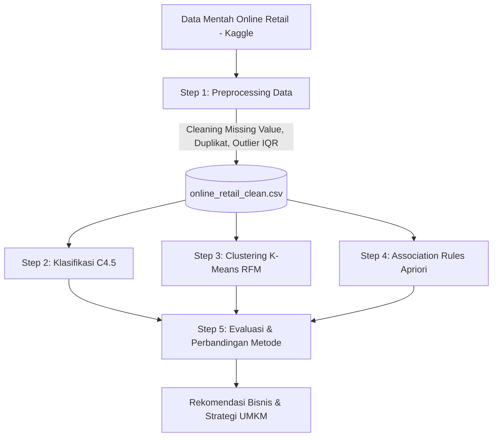

# 🛒 Data Mining — Analisis Siklus KDD pada Dataset Online Retail

[](https://www.python.org/)
[](https://scikit-learn.org/)
[](https://colab.research.google.com/)
[](https://opensource.org/licenses/MIT)

Repositori ini berisi implementasi lengkap **Knowledge Discovery in Databases (KDD)** untuk analisis pola transaksi retail menggunakan Python. Proyek ini disusun untuk memenuhi tugas perkuliahan **Data Mining (21TIF604)** di **Universitas Islam Nahdlatul Ulama (UNISNU) Jepara** dengan dosen pengampu **Ir. Adi Sucipto, M.Kom**.

---

## 📌 Ringkasan Proyek

Proyek ini menerapkan seluruh siklus hidup KDD (Selection, Preprocessing, Transformation, Data Mining, dan Evaluation) menggunakan 3 algoritma fundamental:
1. **Klasifikasi (C4.5 / Decision Tree)**: Memprediksi pelanggan **Loyal (1)** vs **Tidak Loyal (0)** berbasis perilaku belanja.
2. **Clustering (K-Means)**: Segmentasi pelanggan menggunakan framework **RFM (Recency, Frequency, Monetary)**.
3. **Association Rules (Apriori)**: Menemukan pola pembelian produk bersamaan (*Market Basket Analysis*).
4. **Evaluasi & Rekomendasi**: Analisis komparatif ketiga metode untuk pengambilan keputusan strategis bisnis/UMKM.

Sebagai wujud integritas dan validitas data, proyek ini juga dilengkapi dengan **pembuktian matematis manual via Microsoft Excel** untuk memverifikasi logika agregasi dan perhitungan *Entropy & Information Gain* dari data mentah.

---

## 📂 Struktur Repositori

```text
data-mining-2/
│
├── notebooks/                      # Notebook bersih (tanpa output, siap dijalankan)
│   ├── 01_preprocessing.ipynb
│   ├── 02_klasifikasi.ipynb
│   ├── 03_clustering.ipynb
│   ├── 04_association_rules.ipynb
│   └── 05_evaluasi_perbandingan.ipynb
│
├── hasil-run-collab/               # Notebook lengkap dengan visualisasi & output Colab
│   ├── 01_preprocessing.ipynb
│   ├── 02_klasifikasi.ipynb
│   ├── 03_clustering.ipynb
│   ├── 04_association_rules.ipynb
│   └── 05_evaluasi_perbandingan.ipynb
│
├── tools/                          # Script generator pendukung
│   └── generate_excel_proof.py     # Script pembuat dataset Excel pembuktian
│
├── BUKTI-PERHITUNGAN-EXCEL.xlsx     # File Excel pembuktian hitungan manual 3 sheet
├── requirements.txt                # Dependensi pustaka Python
└── .gitignore                      # Konfigurasi filter git untuk data science
```

---

## 🔬 Alur Kerja KDD & Metodologi



### 1. Preprocessing (`01_preprocessing.ipynb`)
- **Penanganan Nilai Hilang**: Menghapus baris tanpa `CustomerID` dan `Description`.
- **Deduplikasi**: Menghilangkan baris transaksi identik (`drop_duplicates`).
- **Pembersihan Anomali**: Menghapus transaksi pembatalan (`Quantity <= 0` / diawali `C`) dan harga tidak valid (`UnitPrice <= 0`).
- **Eliminasi Outlier**: Menggunakan metode statistik **Interquartile Range (IQR)** pada `Quantity` dan `UnitPrice`.

### 2. Klasifikasi C4.5 (`02_klasifikasi.ipynb`)
- **Feature Engineering**: `total_belanja`, `jumlah_produk`, `rata_rata_qty`, dan `rata_rata_belanja`.
- **Target Labeling**: Menggunakan nilai tengah (*median*) dari jumlah transaksi untuk memisahkan kelas tanpa bias outlier.
- **Model**: `DecisionTreeClassifier(criterion='entropy', max_depth=5)`.
- **Evaluasi**: Confusion Matrix, Accuracy (~84%), Precision, Recall, F1-Score, dan visualisasi *Decision Tree*.

### 3. Clustering K-Means (`03_clustering.ipynb`)
- **Metrik RFM**:
  - *Recency*: Jarak hari sejak transaksi terakhir.
  - *Frequency*: Frekuensi transaksi unik.
  - *Monetary*: Akumulasi nominal belanja.
- **Standarisasi**: `StandardScaler` (Z-score normalization).
- **Optimasi K**: *Elbow Method* (WCSS) & *Silhouette Score Analysis*.
- **Hasil Segmentasi**: Identifikasi klaster pelanggan (Premium, Reguler, Berisiko, Pasif).

### 4. Association Rules Apriori (`04_association_rules.ipynb`)
- **Format Data**: *Market Basket Matrix* (one-hot transaction encoding).
- **Mining**: Pustaka `mlxtend` dengan ambang batas *Support*, *Confidence*, dan *Lift Ratio* > 1.
- **Visualisasi**: Matriks asosiasi pasangan produk untuk strategi *cross-selling* dan *bundling*.

### 5. Evaluasi & Komparasi (`05_evaluasi_perbandingan.ipynb`)
- Perbandingan mendalam kelebihan dan limitasi teknis dari masing-masing paradigma data mining (Supervised vs Unsupervised vs Rule-based).
- Rekomendasi kontekstual bisnis retail.

---

## 📊 Pembuktian Manual Excel (Data Integrity)

Untuk menjamin keaslian dan pemahaman terhadap algoritma (*white-box validation*), disediakan file **[BUKTI-PERHITUNGAN-EXCEL.xlsx](BUKTI-PERHITUNGAN-EXCEL.xlsx)** yang memuat:
- **Sheet 1 (Data Mentah)**: 10 sampel baris transaksi mentah.
- **Sheet 2 (Agregasi & Label)**: Simulasi *Pivot Table* per pelanggan dan penetapan label loyalitas berbasis *median*.
- **Sheet 3 (Perhitungan Entropy)**: Hitungan manual rumus matematika Shannon Entropy:
  $$\text{Entropy}(S) = -\sum_{i=1}^{c} p_i \log_2(p_i)$$
  dan *Information Gain* pemecahan atribut `Total Belanja > 11`.

---

## 🚀 Cara Menjalankan

### Opsi A: Google Colab (Direkomendasikan)
1. Buka [Google Colab](https://colab.research.google.com/).
2. Unggah notebook dari folder `notebooks/` secara berurutan:
   - Jalankan `01_preprocessing.ipynb` terlebih dahulu untuk menghasilkan `online_retail_clean.csv` di Google Drive.
   - Jalankan `02_klasifikasi.ipynb` s/d `05_evaluasi_perbandingan.ipynb`.
3. Pustaka eksternal (`kagglehub`, `mlxtend`, `openpyxl`) akan diinstall otomatis di cell pertama.

### Opsi B: Lingkungan Lokal (Python Virtual Environment)
1. **Clone repositori**:
   ```bash
   git clone https://github.com/ustadzCoding-dev/data-mining-retail.git
   cd data-mining-retail
   ```
2. **Buat virtual environment & aktifkan**:
   ```bash
   python -m venv venv
   # Windows (PowerShell):
   .\venv\Scripts\Activate.ps1
   # Linux/macOS:
   source venv/bin/activate
   ```
3. **Install dependensi**:
   ```bash
   pip install -r requirements.txt
   ```
4. **Jalankan Jupyter Notebook**:
   ```bash
   jupyter notebook
   ```

---

## 📚 Sitasi Dataset

> Chen, D. (2012). **Online Retail** [Dataset]. UCI Machine Learning Repository.  
> DOI: [https://doi.org/10.24432/C5CG6D](https://doi.org/10.24432/C5CG6D)  
> *Mirror Kaggle oleh lakshmi25npathi/online-retail-dataset.*

---

## 👨‍💻 Kontributor

- **Penulis / Mahasiswa**: **Afrizal Ilzam Munadhif** ([@ustadzCoding-dev](https://github.com/ustadzCoding-dev))
- **Mata Kuliah**: Data Mining (21TIF604)
- **Dosen Pengampu**: Ir. Adi Sucipto, M.Kom
- **Program Studi**: Teknik Informatika
- **Fakultas**: Sains dan Teknologi
- **Institusi**: Universitas Islam Nahdlatul Ulama (UNISNU) Jepara
